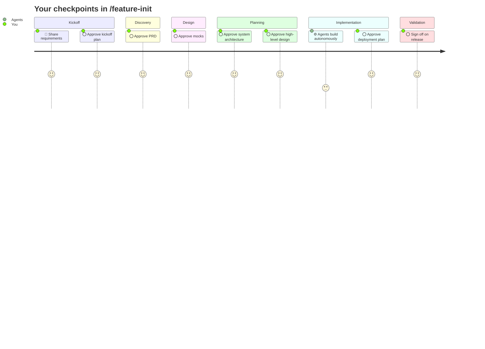

This is an AI-assisted software development framework built on Claude Code. It comes with specialized agents that mimic a real scrum team, designed to deliver reliably through role-specific skills and predefined rules that enforce engineering and coding conventions. They collaborate with each other the way real team members do, stop at every major milestone to wait for your input, and pick up exactly where you left off if a session is interrupted. Nothing moves forward without your approval.

Used to ship [full-stack web applications](https://github.com/sans-github/fitness-tracker-app) (Java, Spring Boot, React) deployed on AWS with Terraform, and Mac desktop applications.

---

## Get started

### Install

`bash <(curl -fsSL https://raw.githubusercontent.com/sans-github/agentic-delivery-framework/main/install.sh)`

Copies agents, rules, skills, and templates into `.claude/`, and wires up `CLAUDE.md` so Claude Code loads your stack config automatically. Commit the result to lock the version.

### Try it first (recommended)

Type `/feature-init-dry-run` before committing to a real feature. Every agent writes placeholder output instead of real artifacts, but all checkpoints, commits, and progress steps fire for real. You see exactly how the team operates before anything real gets built.

### Run your first feature

Type `/feature-init` to start. Claude asks for your requirements, coordinates the team, and checks in with you at each step before moving on.

After release, three wrap-up stages run automatically: documentation refresh, consolidating the product baseline, and release sign-off. None are skippable.

---

## Learn more

- [How it works](docs/how-it-works.md)
- [Contributing](CONTRIBUTING.md)
